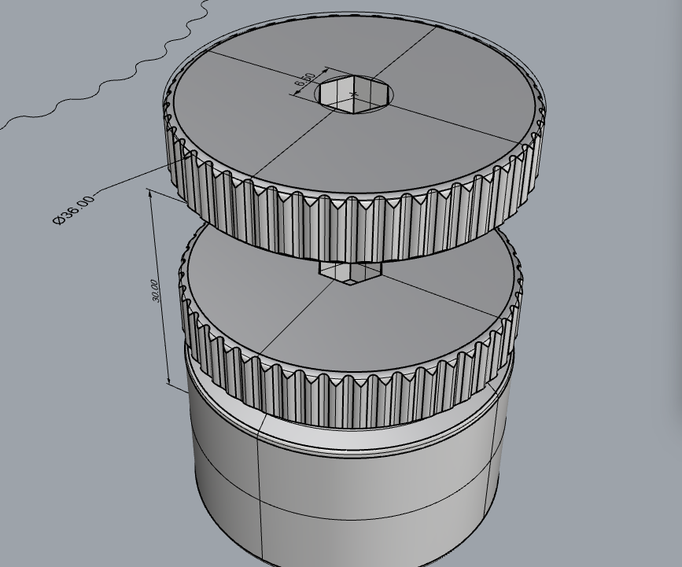

# PortableScrewdriverBox

Welcome to the **PortableScrewdriverBox** project! This is a compact and portable bit storage box designed to hold seven 6.5mm, 25mm-long bits. The lid doubles as a bit holder with an anti-slip grip, making it especially useful in tight spaces, such as sewing machine covers.  

## Features  

- **Portable Design**: A small screwdriver box that is easy to carry, with a height of 30mm and a diameter of 36mm.  
- **Low Material Usage & Quick Print**: Uses less than 15g of filament and prints in just 40 minutes.  
- **Bit Storage**: Holds up to seven 6.5mm, 25mm-long bits for easy swapping.  
- **Lid as a Bit Holder for Tight Spaces**: The lid serves as a bit holder, making it ideal for working in confined spaces, such as maintaining sewing machines.  
- **Anti-Slip & High Torque**: The lid features an anti-slip grip and a 36mm diameter, providing greater torque.  

## Preview  

### Dimensions Preview  

### Real Shots  
<!-- todo -->
