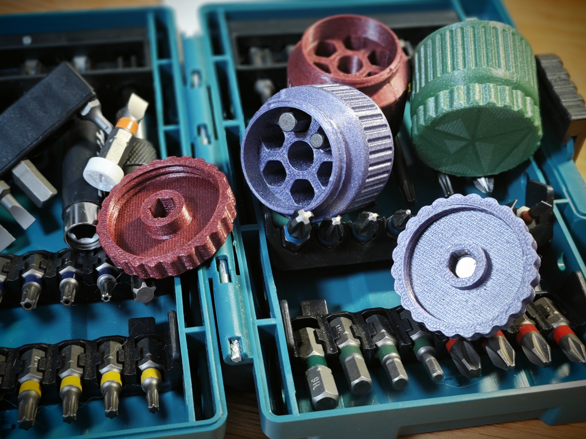

# PortableScrewdriverBox

Welcome to the **PortableScrewdriverBox** project! This is a compact and portable screwdriver bit storage box designed for users who need to work in confined spaces. The box can hold seven 6.35mm, 25mm long screwdriver bits, and its lid is designed to securely store the bits, featuring anti-slip strips, making it especially useful for tight spaces, such as maintenance work in areas like sewing machine covers.

## Features

- **Portable Design**: A compact screwdriver box, easy to carry, with a height of 30mm and a diameter of 36mm, lightweight and convenient.
- **Material-saving, Quick Print**: Uses less than 15g of filament with an estimated print time of about 40 minutes, ideal for quick production.
- **Bit Storage**: Designed to hold 7 pieces of 6.35mm, 25mm long screwdriver bits, making it easy to replace them as needed.
- **Compact Lid Design for Tight Spaces**: The lid can hold bits securely, with a compact design perfect for use in restricted environments, such as maintenance on sewing machines and other equipment.
- **Anti-slip, High Torque Design**: The lid features anti-slip strips for better torque (36mm diameter), improving stability during use.
- **Reserved Magnet Slot**: The lid includes a slot for a D=6.1mm, h=1mm magnet, which can be used to hold the bits in place, preventing loosening and dropping after repeated use.

## Preview

### Dimension Preview

The bit mounting slot on the lid has a length of 6.5mm on each side. Depending on the brand of bits or filament used, slight adjustments to the hole size may be needed. An STP file is provided, allowing users to modify the design as needed.

### Real Shots

