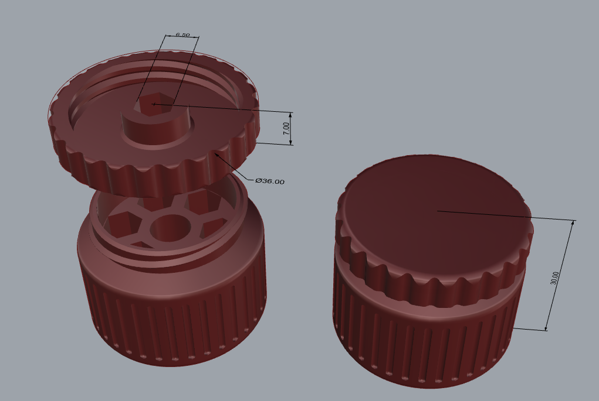

# PortableScrewdriverBox

欢迎来到 **PortableScrewdriverBox** 项目！这是一个小巧便携的批头收纳盒设计，该盒子不仅能容纳七枚 6.5mm，25mm 长的批头，而且其盖子还可以安装批头并且带有防滑条，方便在空间受限的地方使用，特别适合像缝纫机盖板这类空间狭小的位置。

## 特点

- **便携设计**：小巧的螺丝刀盒子，适合随身携带，高度30mm， 直径36mm。
- **用料少，快速打印**：不到15g耗材，40分钟打印时长。
- **容纳批头**：可以容纳7枚 6.5mm，25mm 长的批头，方便随时替换。
- **盖子可用安装批头适用狭小空间**：盖子可用来安装批头，设计紧凑，特别适合在狭小空间中使用，如缝纫机等设备的维护。
- **防滑高扭矩**：盖子带有防滑条，直径有36mm，提供较大扭矩。

## 预览

### 尺寸预览

### 实拍图
<!-- todo -->