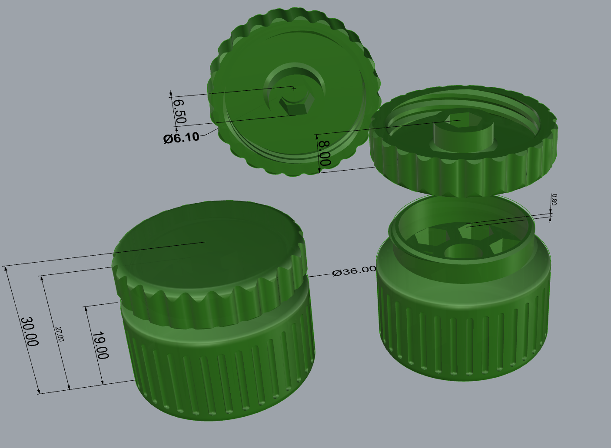
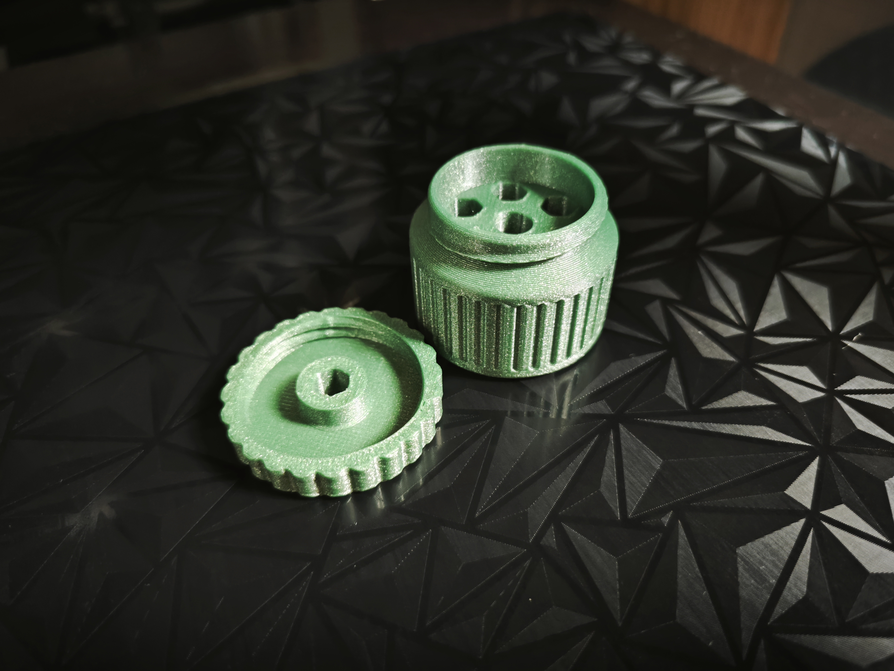
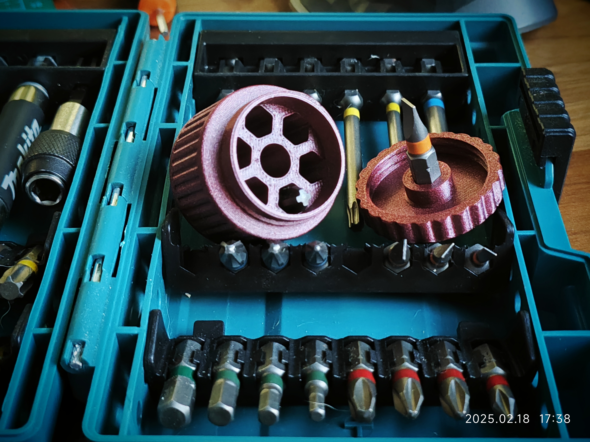

# PortableScrewdriverBox

欢迎来到 **PortableScrewdriverBox** 项目！这是一款小巧便携的批头收纳盒，专为需要在狭小空间中操作的用户设计。该收纳盒能够容纳七枚6.35mm、25mm长的批头，并且其盖子设计可以安装批头，配有防滑条，特别适合在空间受限的环境中使用，特别适合像缝纫机盖板等狭小区域的维护。

## 特点

- **便携设计**：小巧的螺丝刀盒，适合随身携带，盒高30mm，直径36mm，轻巧方便。
- **节省材料，快速打印**：仅使用不到15g的耗材，打印时间约40分钟，适合快速制作。
- **批头存储**：设计可容纳7枚6.35mm、25mm长的批头，方便随时替换。
- **盖子设计适合狭小空间**：盒盖可以安装批头，设计紧凑，特别适合空间受限的环境，如缝纫机等设备的维护工作。
- **防滑高扭矩设计**：盖子配有防滑条，提供更大的扭矩（直径36mm），提高使用稳定性。
- **预留磁铁槽位**：盖子里预留D=6.1mm，h=1mm磁铁槽位，可用于吸住批头，避免多次使用后孔位松动批头掉落。

## 预览

### 尺寸预览

盖子上的批头安装槽对边长度为6.5mm。不同品牌的批头或耗材可能需要微调孔洞大小。已提供STP文件，用户可根据需要自行修改调整。

### 实拍图

